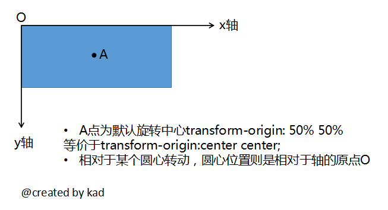

##任务描述 [demo](https://kad0108.github.io/IFE/task26)

* 如图（打开查看），创建一个虚拟宇宙，包括一个行星和飞船
* 每个飞船由以下部分组成：
* 动力系统，可以完成飞行和停止飞行两个行为，暂定所有飞船的动力系统飞行速度是一致的，比如每秒20px，飞行过程中会按照一定速率消耗能源（比如每秒减5%）
* 能源系统，提供能源，并且在宇宙中通过太阳能充电（比如每秒增加2%，具体速率自定）
* 信号接收处理系统，用于接收行星上的信号
* 自爆系统，用于自我销毁
* 每个飞船的能源是有限的，用一个属性来表示能源剩余量，这是一个百分比，表示还剩余多少能源。
* 能源耗尽时，飞船会自动停止飞行
* 飞船有两个状态：飞行中和停止，飞船的行为会改变这个属性状态
* 飞船的自我销毁方法会立即销毁飞船自身
* 行星上有一个指挥官（不需要在页面上表现出其形象），指挥官可以通过行星上的信号发射器发布如下命令
* 创建一个新的飞船进入轨道，最多可以创建4个飞船，刚被创建的飞船会停留在某一个轨道上静止不动
* 命令某个飞船开始飞行，飞行后飞船会围绕行星做环绕运动，需要模拟出这个动画效果
* 命令某个飞船停止飞行
* 命令某个飞船销毁，销毁后飞船消失、飞船标示可以用于下次新创建的飞船
* 你需要设计类似如下指令格式的数据格式
```
{
	id: 1,
	commond: 'stop'
}
```	
* 指挥官通过信号发射器发出的命令是通过一种叫做Mediator的介质进行广播
* Mediator是单向传播的，只能从行星发射到宇宙中，在发射过程中，有30%的信息传送失败（丢包）概率，你需要模拟这个丢包率，另外每次信息正常传送的时间需要1秒
* 指挥官并不知道自己的指令是不是真的传给了飞船，飞船的状态他是不知道的，他只能通过自己之前的操作来假设飞船当前的状态
* 每个飞船通过信号接收器，接受到通过Mediator传达过来的指挥官的广播信号，但因为是广播信号，所以每个飞船能接受到指挥官发出给所有飞船的所有指令，因此需要通过读取信息判断这个指令是不是发给自己的

##参考资料

* [4 JavaScript Design Patterns You Should Know](https://scotch.io/bar-talk/4-javascript-design-patterns-you-should-know#module-design-pattern)：Module(模块),Prototype(原型),Observer(观察者),Singleton(单例)
* [Learning JavaScript Design Patterns](https://addyosmani.com/resources/essentialjsdesignpatterns/book/#decoratorpatternjavascript)
* [Understanding Design Patterns in JavaScript](https://code.tutsplus.com/tutorials/understanding-design-patterns-in-javascript--net-25930)
* [汤姆大叔讲JS](http://www.cnblogs.com/TomXu/archive/2011/12/15/2288411.html)
* [适配器、装饰者、工厂模式](http://www.adobe.com/cn/devnet/html5/articles/javascript-design-patterns-pt2-adapter-decorator-factory.html)

##知识点

* transform-origin属性用来设置转换元素的旋转中心，相对于某个圆心运动的设置，自己的理解：
* margin:0 auto;元素居中失效原因：必须给居中元素设置宽度；元素不能脱离文档流。
* 通过setInterval不停的判断飞船的状态来进行相应的操作。
* nextSibling属性返回指定节点之后紧跟的节点包括text节点，nextElementSibling返回之后的dom节点。
* 用Math.random()模拟丢包