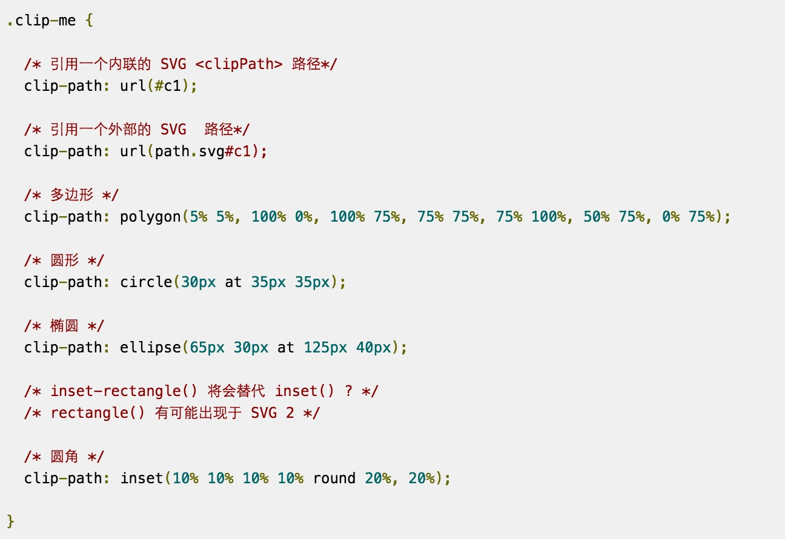

## 任务描述 [demo](https://kad0108.github.io/IFE/2016/task43)

* 参考下方设计图，使用JavaScript、CSS，实现在不同图片数量时的不同布局
* 实现封装为一个JavaScript的库
* 

## 知识点

* clip-path属性实现剪切效果，起笔点和落笔点连线剪切出的图形。
* 用CSS3实现了几种loading效果，[看这里](https://github.com/kad0108/Html5/tree/gh-pages/loading)
* cover是背景铺满元素，调整图片宽高的较小者铺满。contain是元素包含整个图片，调整图片宽高的较大者使背景图片完全包含在元素中。
* object-fit和background-size属性的区别

```
object是指替换元素，object-fit用于设置元素的图像尺寸
background-size用于设置<div style="background-image: url('')">元素的背景图像尺寸
但是background-image元素在右键菜单中并不会被当作图片处理
```

* 一般的图片剪裁，都会在firefox下有兼容性问题，解决方法是创建svg。
* classList属性返回元素的class，用于在元素中添加移除及切换CSS类。
* Array.prototype.reduce方法接受一个函数作为累加器，数组中每个值从左到右做函数处理，返回一个值。
* [参考的团队代码](https://github.com/kad0108/gallery)使用了第三方的图片服务器，通过ajax异步请求图片数据的回调函数展示画廊。我自己的图片和js就在同一目录下，那么就等图片全部预加载完成再执行回调函数。参考[JS实现图片预加载](http://www.cnblogs.com/mz121star/archive/2012/11/01/javascript_preloadimages.html)
* first-child是取指定元素的母元素的第一个子元素，last-child同理。
* 如果appendChild的参数是页面存在的一个元素，则执行后原来的元素会被移除。我把images[0]先后appendchild给了gallery1和gallery2，然后就只有gallery2中有img元素，gallery1中是空白。images中存放的是HTMLImageElement元素，appendChild性能要比innerHTML性能高。
* 对不同图片数量布局的实现，可以直接absolute定位设置top、left等属性；也可以float浮动占位排列。因为参考的队伍采用了float，图片的长宽通过js计算得到，出现bug改变浏览器宽度布局打乱，我通过直接指定每一种布局div的宽高避免布局打乱。
* 任务还提供了image placeholder的方式，通过请求一个固定大小颜色的图片来展示，这个可以用到后面的瀑布流任务中。[image placeholder](https://placehold.it/)

## 参考



[CSS clip-path maker](http://bennettfeely.com/clippy/)

[SVG元素手册](http://www.runoob.com/svg/svg-reference.html)

[CSS3 clip-path polygon图形构建与动画变换](http://www.zhangxinxu.com/wordpress/2015/03/css3-clip-path-polygon-shape-transition-animation/)

[clip-path详解](http://www.tuicool.com/articles/E3IRbmJ)

[clip-path VS svg](http://www.w3cplus.com/css3/creating-responsive-shapes-with-clip-path.html)

[CSS3 object-x属性](http://www.zhangxinxu.com/wordpress/2015/03/css3-object-position-object-fit/comment-page-1/)


