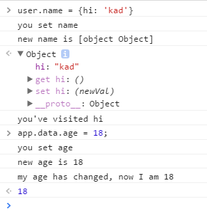

## Vue数据绑定

### Object.defineProperty

ECMAScript中有两种属性：数据属性和访问器属性。

要修改属性默认的特性，必须使用Object.defineProperty()，接收三个参数，属性所在对象，属性名，数据属性对象。

数据属性有：configurable（delete是否可删除），enumerable（for-in枚举），writable，value。

在读取访问器属性时，会调用getter函数，在写入访问器属性时，会调用setter函数。
```
var book = {
	_year: 2016
};
Object.defineProperty(book, 'year', {
	get: function(){
		return this._year;
	},
	set: function(val){
		this._year = val;
	}
});
alert(book.year);//2016
book.year = 2017;
alert(book.year);//2017
```

### 如何监听一个对象的变化

1. 当对象的某个属性变化的时候，如何触发自定义的回调函数？ Object.defineProperty()
2. 对象的某个属性仍然可能是一个对象，递归。

### 观察者模式

又称发布-订阅者模式。观察者对象，有一个消息容器和三个方法，分别是订阅消息、取消消息、发布消息

```
function Observer(){
	this._msgs = {};
}
Observer.prototype = {
	regist: function(type, fn){
		if(!(type in this._msgs)){
			this._msgs[type] = [];
		}
		this._msgs[type].push(fn);		
	},
	emit: function(type, args){
		if(!this._msgs[type]) return;
		for(var i = 0, len = this._msgs[type].length; i < len; i++){
			this._msgs[type][i].call(this, args);
		}
	},
	remove: function(type, fn){
		if(this._msgs[type] instanceof Array){
			for(var i = this._msgs[type].length-1; i >= 0; i--){
				this._msgs[type][i] === fn && this._msgs[type].splice(i, 1);
			}
		}
	}
}
```



### Reference

[vue早期源码学习系列之一：如何监听一个对象的变化](https://github.com/youngwind/blog/issues/84)