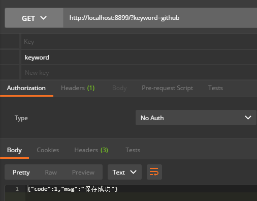
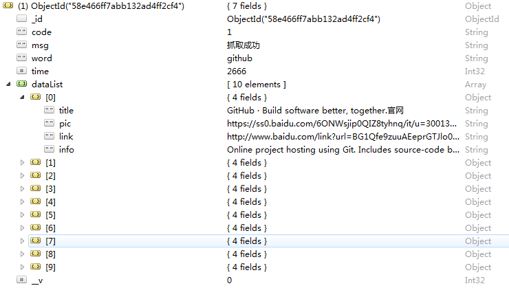

# Web Capture ———— Server

### 任务 

封装一个Node服务，收到请求后，启动phantomjs返回抓取json结果，Node服务将结果保存到MongoDB中。

### 技术

- Node
- Mongoose
- co
- phantom

### 运行

```
npm install 

node index
```

GET请求传入keyword参数，接收响应结果



MongoDB存储抓取数据



### 知识点

* HTTP Request分为4个部分，URL、Method、Headers、Body。

* POST请求获取Request Body：
```
http.createServer(function(request, response) {
	let data = '';
	request.on('error', function(err) {
		console.error(err);
	}).on('data', function(chunk) {
		data += chunk; // chunk is a buffer
	}).on('end', function() {
		console.log(data);
		response.end('received');
	});
}).listen(8899, function(){
	console.log('server started');
});
```

## 参考

[Node HTTP Request](https://nodejs.org/en/docs/guides/anatomy-of-an-http-transaction/#request-body)
